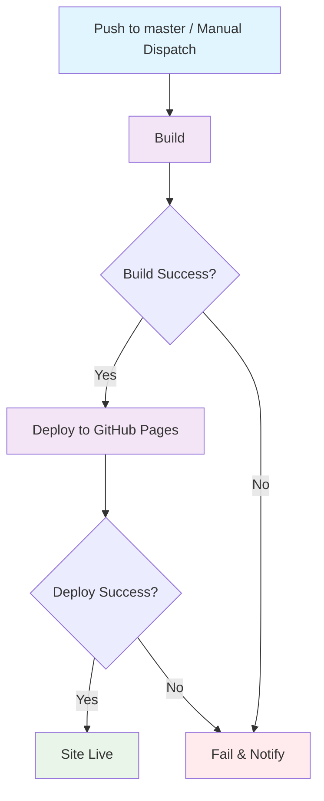

## Workflow Overview

**Purpose**: Build the Rspress documentation site and deploy static assets to GitHub Pages on every push to the `master` branch.
**Trigger Events**: Push to `master` branch; manual dispatch (`workflow_dispatch`)
**Target Environments**: GitHub Pages (`https://heyq02.github.io/resume/`)

## Execution Flow Diagram



## Jobs & Dependencies

| Job Name | Purpose | Dependencies | Execution Context |
|----------|---------|--------------|-------------------|
| build | Install dependencies, build Rspress site, upload artifact | None | Ubuntu latest, Node.js LTS |
| deploy | Deploy build artifact to GitHub Pages | build (success) | GitHub Pages environment |

## Requirements Matrix

### Functional Requirements

| ID | Requirement | Priority | Acceptance Criteria |
|----|-------------|----------|-------------------|
| REQ-001 | Build Rspress site from `docs/` source | High | `rspress build` completes with exit code 0, output in `doc_build/` |
| REQ-002 | Deploy static assets to GitHub Pages | High | Site accessible at `https://heyq02.github.io/resume/` |
| REQ-003 | Support manual trigger for ad-hoc deploys | Medium | `workflow_dispatch` triggers full build-deploy pipeline |
| REQ-004 | Serve site under `/resume/` base path | High | All asset paths resolve correctly under the subpath |
| REQ-005 | Single concurrent deployment at any time | High | No parallel deploys overwrite each other |

### Security Requirements

| ID | Requirement | Implementation Constraint |
|----|-------------|---------------------------|
| SEC-001 | No secrets exposed in build logs | Build output must not echo tokens or keys |
| SEC-002 | Deploy via GitHub-managed OIDC token | Use `id-token: write` permission, no long-lived PATs |
| SEC-003 | Artifact integrity between jobs | Use GitHub Actions artifact mechanism for build handoff |

### Performance Requirements

| ID | Metric | Target | Measurement Method |
|----|--------|--------|-------------------|
| PERF-001 | Total pipeline duration | < 5 minutes | GitHub Actions run time |
| PERF-002 | Build step duration | < 3 minutes | Job step timing |
| PERF-003 | Dependency install time | < 90 seconds | Measured with caching enabled |

## Input/Output Contracts

### Inputs

```yaml
# Repository Triggers
branches: [master]
workflow_dispatch: enabled

# Build Configuration (derived from project)
source_directory: docs/
build_command: rspress build
output_directory: doc_build/
base_path: /resume/
node_version: LTS (22.x)
```

### Outputs

```yaml
# Build Job Outputs
build_artifact: file  # Static site bundle (HTML/CSS/JS/assets) from doc_build/
page_artifact: file   # GitHub Pages-compatible artifact

# Deploy Job Outputs
deployed_url: string  # https://heyq02.github.io/resume/
```

### Secrets & Variables

| Type | Name | Purpose | Scope |
|------|------|---------|-------|
| Auto | `GITHUB_TOKEN` | Pages deployment authentication (OIDC) | Workflow |

## Execution Constraints

### Runtime Constraints

- **Timeout**: 15 minutes (whole workflow)
- **Concurrency**: 1 deployment at a time; cancel in-progress on new push
- **Resource Limits**: Default GitHub-hosted runner resources

### Environmental Constraints

- **Runner Requirements**: Ubuntu latest
- **Node.js**: LTS version (22.x)
- **Network Access**: npm registry (install), GitHub Pages API (deploy)
- **Permissions**:
  - `contents: read` (checkout)
  - `pages: write` (deploy)
  - `id-token: write` (OIDC authentication)

## Error Handling Strategy

| Error Type | Response | Recovery Action |
|------------|----------|-----------------|
| Dependency install failure | Fail build job | Retry workflow; check `package-lock.json` integrity |
| Build failure | Fail build job | Check build logs; fix source errors and re-push |
| Artifact upload failure | Fail build job | Retry workflow |
| Pages deploy failure | Fail deploy job | Retry workflow; verify Pages settings in repo |
| Concurrent deploy conflict | Cancel in-progress | Latest push wins; previous deploy cancelled |

## Quality Gates

### Gate Definitions

| Gate | Criteria | Bypass Conditions |
|------|----------|-------------------|
| Build Success | `rspress build` exits 0 with non-empty `doc_build/` | None |
| Artifact Integrity | Upload/download artifact hash matches | None |

## Monitoring & Observability

### Key Metrics

- **Success Rate**: > 95% of pushes deploy successfully
- **Execution Time**: Average < 3 minutes
- **Resource Usage**: Standard GitHub Actions minutes tracking

### Alerting

| Condition | Severity | Notification Target |
|-----------|----------|-------------------|
| Deploy failure | High | GitHub Actions email notification (repo default) |
| Build failure | Medium | GitHub Actions email notification (repo default) |

## Integration Points

### External Systems

| System | Integration Type | Data Exchange | SLA Requirements |
|--------|------------------|---------------|------------------|
| npm Registry | Package download | `package-lock.json` -> node_modules | Available during install |
| GitHub Pages | Static hosting | Build artifact -> CDN | 99.9% uptime (GitHub SLA) |

### Dependent Workflows

| Workflow | Relationship | Trigger Mechanism |
|----------|--------------|-------------------|
| None | - | - |

## Compliance & Governance

### Audit Requirements

- **Execution Logs**: Retained per GitHub Actions default (90 days)
- **Approval Gates**: None (auto-deploy on push to master)
- **Change Control**: Changes to workflow require PR review

### Security Controls

- **Access Control**: Repository collaborators can trigger; OIDC scoped to repo
- **Secret Management**: No custom secrets; GitHub-managed OIDC tokens only
- **Vulnerability Scanning**: Not in scope (static content only)

## Edge Cases & Exceptions

### Scenario Matrix

| Scenario | Expected Behavior | Validation Method |
|----------|-------------------|-------------------|
| Empty commit (no doc changes) | Full rebuild and redeploy | Monitor workflow triggers |
| Concurrent pushes to master | Cancel in-progress, run latest | Verify concurrency group behavior |
| Manual dispatch during active deploy | Cancel active, run manual | Trigger manually during push-deploy |
| Large asset added (>50MB) | Build succeeds if within Pages limit | Add large file, verify deploy |
| Build output is empty | Build job fails | Verify non-empty artifact gate |
| Node.js LTS version bumps | Build still succeeds | Periodically verify with new LTS |

## Validation Criteria

### Workflow Validation

- **VLD-001**: Push to `master` triggers build and deploy within 30 seconds
- **VLD-002**: Manual dispatch triggers identical pipeline
- **VLD-003**: Build artifact contains `index.html` at root
- **VLD-004**: Deployed site resolves at `https://heyq02.github.io/resume/`
- **VLD-005**: Concurrent pushes result in only the latest deployment active
- **VLD-006**: Non-master branch pushes do NOT trigger the workflow

### Performance Benchmarks

- **PERF-001**: End-to-end pipeline completes in < 5 minutes
- **PERF-002**: Cached dependency install completes in < 30 seconds

## Caching Strategy

| Cache Target | Key Pattern | Restore Keys | Purpose |
|-------------|-------------|-------------|---------|
| npm dependencies | `npm-${{ runner.os }}-${{ hashFiles('package-lock.json') }}` | `npm-${{ runner.os }}-` | Speed up dependency install |

## Change Management

### Update Process

1. **Specification Update**: Modify this document first
2. **Review & Approval**: PR review by repository owner
3. **Implementation**: Apply changes to `.github/workflows/deploy.yml`
4. **Testing**: Push to a test branch or use manual dispatch
5. **Deployment**: Merge to master

### Version History

| Version | Date | Changes | Author |
|---------|------|---------|--------|
| 1.0 | 2026-09-15 | Initial specification | heyq02 |

## Related Specifications

- [Rspress v2 Documentation](https://rspress.dev/)
- [GitHub Pages Deployment Guide](https://docs.github.com/en/pages)
- [GitHub Actions: Deploy to Pages](https://github.com/actions/deploy-pages)
